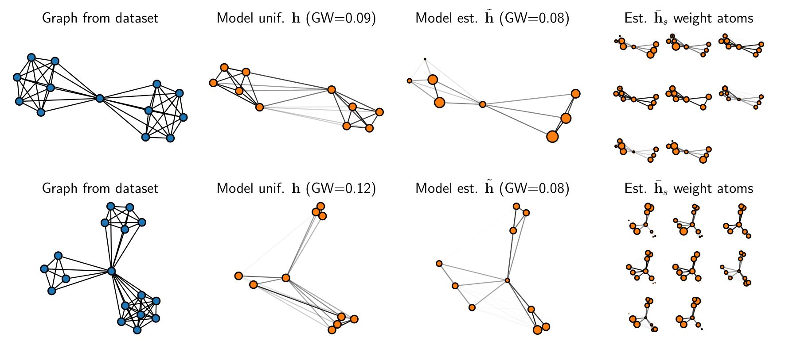

# GDL
Python code for the paper [Online Graph Dictionary Learning](http://proceedings.mlr.press/v139/vincent-cuaz21a.html).

  

If you find this repository useful for your research please cite GDL using the following bibtex reference:

@InProceedings{pmlr-v139-vincent-cuaz21a,
  title = 	 {Online Graph Dictionary Learning},
  author =       {Vincent-Cuaz, C{\'e}dric and Vayer, Titouan and Flamary, R{\'e}mi and Corneli, Marco and Courty, Nicolas},
  booktitle = 	 {Proceedings of the 38th International Conference on Machine Learning},
  pages = 	 {10564--10574},
  year = 	 {2021},
  editor = 	 {Meila, Marina and Zhang, Tong},
  volume = 	 {139},
  series = 	 {Proceedings of Machine Learning Research},
  month = 	 {18--24 Jul},
  publisher =    {PMLR},
  pdf = 	 {http://proceedings.mlr.press/v139/vincent-cuaz21a/vincent-cuaz21a.pdf},
  url = 	 {http://proceedings.mlr.press/v139/vincent-cuaz21a.html},
  abstract = 	 {Dictionary learning is a key tool for representation learning, that explains the data as linear combination of few basic elements. Yet, this analysis is not amenable in the context of graph learning, as graphs usually belong to different metric spaces. We fill this gap by proposing a new online Graph Dictionary Learning approach, which uses the Gromov Wasserstein divergence for the data fitting term. In our work, graphs are encoded through their nodes’ pairwise relations and modeled as convex combination of graph atoms, i.e. dictionary elements, estimated thanks to an online stochastic algorithm, which operates on a dataset of unregistered graphs with potentially different number of nodes. Our approach naturally extends to labeled graphs, and is completed by a novel upper bound that can be used as a fast approximation of Gromov Wasserstein in the embedding space. We provide numerical evidences showing the interest of our approach for unsupervised embedding of graph datasets and for online graph subspace estimation and tracking.}
}

  

This repository contains implementations of our methods  which led to results detailed in the numerical experiments. Namely vanilla GDL for unlabeled graphs, its extension where we simultaneously learn graphs structure and their nodes relative importance, and its extension to labeled graphs as detailed in the supplementary material of the paper.

**Prerequisites**

- python >= 3.7.7
- pot >= 0.6.0 [POT Python Optimal Transport library](https://pythonot.github.io/)
- cython >= 0.29.20
- numpy >= 1.18.5
- pandas >= 1.0.5
- networkx >= 2.4
- scikit-learn >= 0.24.0
- scikit-learn-extra >= 0.1.0b2
- scipy >= 1.5.0
- joblib == 0.15.1 

**Data**

Datasets used for unsupervised and supervised classification benchmarks are stored in subrepository data/. Datasets used for online experiments have been omitted for reasons of storage limitation. All these datasets can be found here [Benchmark Data Sets for Graph Kernels](https://ls11-www.cs.tu-dortmund.de/staff/morris/graphkerneldatasets) and directly used in our pipelines.

**Code**

- Experiments with vanilla GDL can be reproduced as follow (for e.g on IMDB-BINARY dataset):

      python run_GW_GDL.py --dataset_name "imdb-b" --list_number_atoms [4,8,12,16] --list_shape_atoms [17] --list_l2reg [0.0,0.001,0.01,0.1] --epochs 30 --batch_size 16 --learning_rate 0.01 --mode "ADJ"
  
  or equivalently
  
      python run_GW_GDL.py -ds "imdb-b" -natoms [4,8,12,16] -satoms [17] -reg [0.0,0.001,0.01,0.1] -ep 30 -b 16 -lr 0.01 -mode "ADJ"

- Experiments on toy datasets detailed in section 4.1:
  

  

      python run_GW_GDL.py -ds "balanced_clustertoy" -natoms [3] -satoms [6] -reg [0.0,0.001] -ep 20 -b 16 -lr 0.01 -mode "ADJ"
      

  

      
      python run_GW_GDL.py -ds "clustertoy2C" -natoms [2] -satoms [12] -reg [0.0] -ep 20 -b 16 -lr 0.01 -mode "ADJ"

- Experiments with GDL using Fused Gromov-Wasserstein for labeled graphs:

      python run_FGW_GDL.py -ds "mutag" -natoms [4] -satoms [17] -reg [0.0] -alpha [0.25,0.5] -ep 40 -b 16 -lrC 0.01 -lrA 0.01 -mode "ADJ"

- Experiments with the proposed extension of GDL where we simultaneously learn atoms structure and their nodes relative importance:

  

      python run_GW_extendedDL.py -ds "imdb-m" -natoms [12] -satoms [10] -regC [0.0] -ep 40 -b 16 -lrC 0.01 -lrh 0.001 -mode "ADJ"
- Online experiments have their dedicated run files with preset parameters: run_streamingTWITCH.py    &     run_streamingTRIANGLES.py

   

  

**Authors**

  - [Cédric Vincent-Cuaz](https://twitter.com/cedriccuaz) 
  - [Titouan Vayer](https://tvayer.github.io/)
  - [Rémi Flamary](http://remi.flamary.com/)
  - [Marco Cornali](https://math.unice.fr/~mcorneli/)
  - [Nicolas Courty](https://people.irisa.fr/Nicolas.Courty/)

**References**

[1] Rémi Flamary, Nicolas Courty, Alexandre Gramfort, Mokhtar Z. Alaya, Aurélie Boisbunon, Stanislas Chambon, Laetitia Chapel, Adrien Corenflos, Kilian Fatras, Nemo Fournier, Léo Gautheron, Nathalie T.H. Gayraud, Hicham Janati, Alain Rakotomamonjy, Ievgen Redko, Antoine Rolet, Antony Schutz, Vivien Seguy, Danica J. Sutherland, Romain Tavenard, Alexander Tong, Titouan Vayer;, [POT Python Optimal Transport library](https://pythonot.github.io/), Journal of Machine Learning Research, 22(78):1−8, 2021.

[2]  Kristian Kersting and Nils M. Kriege and Christopher Morris and Petra Mutzel and Marion Neumann, [Benchmark Data Sets for Graph Kernels](https://ls11-www.cs.tu-dortmund.de/staff/morris/graphkerneldatasets)

